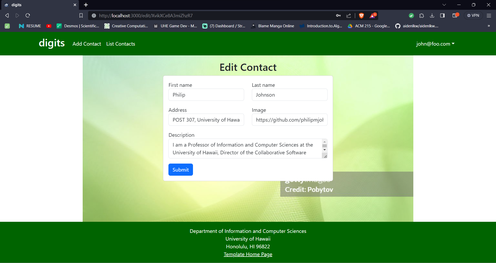

digits is a Meteor 2.9 application that illustrates:

* Contacts and a contact list
* The ability to add contacts
* THe ability to add notes to contacts

#### Installation

Go to http://aidenlkw.gihub.io/digits

#### Landing page

When you retrieve the app at http://localhost:3000, this is what should be displayed:


The next step is to use the Login menu to either Login to an existing account or register a new account.

#### Login page

Clicking on the Login link, then on the Sign In menu item displays this page:


#### Register page

Alternatively, clicking on the Login link, then on the Sign Up menu item displays this page:


#### Landing (after Login) page, non-Admin user

Once you log in (either to an existing account or by creating a new one), the navbar changes as follows:


You can now add new Stuff documents, and list the Stuff you have created. Note you cannot see any Stuff created by other users.

#### Add Contact page

After logging in, here is the page that allows you to add new Contacts:


#### List Contacts page

After logging in, here is the page that allows you to list all the Contacts you have created:


You click the "Edit" link to go to the Edit Stuff page, shown next.

#### Edit Contact page

After clicking on the "Edit" link associated with an item, this page displays that allows you to change and save it:



#### Landing (after Login), Admin user

You can define an "admin" user in the settings.json file. This user, after logging in, gets a special entry in the navbar:


#### Admin page (list all users contacts)

To provide a simple example of a "super power" for Admin users, the Admin page lists all of the Contacts by all of the users:


Note that non-admin users cannot get to this page, even if they type in the URL by hand.

### Collections

The application implements a single Collection called "Contacts". Each Contacts document has the following fields: firstName, lastName, address, image, owner and _id.

The Contacts collection is defined in [imports/api/contact/Contacts.js](https://github.com/ics-software-engineering/meteor-application-template-react/blob/main/app/imports/api/stuff/stuff.js).

The Contacts collection is initialized in [imports/startup/server/Mongo.js](https://github.com/ics-software-engineering/meteor-application-template-react/blob/main/app/imports/startup/server/Mongo.js).

### CSS

The application uses the [React implementation of Bootstrap 5](https://react-bootstrap.github.io/). You can adjust the theme by editing the `app/client/style.css` file. To change the theme override the Bootstrap 5 CSS variables.

```css
/* Change bootstrap variable values.
 See https://getbootstrap.com/docs/5.2/customize/css-variables/
 */
body {
  --bs-light-rgb: 236, 236, 236;
}

/* Define custom styles */
.gray-background {
  background-color: var(--bs-gray-200);
  color: var(--bs-dark);
  padding-top: 10px;
  padding-bottom: 20px;
}
```

### Routing

For display and navigation among its four pages, the application uses [React Router](https://reacttraining.com/react-router/).

Routing is defined in [imports/ui/layouts/App.jsx](https://github.com/ics-software-engineering/meteor-application-template-react/blob/main/app/imports/ui/layouts/App.jsx).


### Authentication

For authentication, the application uses the Meteor accounts package.

When the application is run for the first time, a settings file (such as [config/settings.development.json](https://github.com/ics-software-engineering/meteor-application-template-react/blob/main/config/settings.development.json)) should be passed to Meteor. That will lead to a default account being created through the code in [imports/startup/server/accounts.js](https://github.com/ics-software-engineering/meteor-application-template-react/blob/main/app/imports/startup/server/accounts.js).

The application allows users to register and create new accounts at any time.

### Authorization

Only logged in users can manipulate Stuff documents (but any registered user can manipulate any Stuff document, even if they weren't the user that created it.)

### Configuration

The [config](https://github.com/ics-software-engineering/meteor-application-template-react/blob/main/config) directory is intended to hold settings files.  The repository contains one file: [config/settings.development.json](https://github.com/ics-software-engineering/meteor-application-template-react/blob/main/config/settings.development.json).

The [.gitignore](https://github.com/ics-software-engineering/meteor-application-template-react/blob/main/.gitignore) file prevents a file named settings.production.json from being committed to the repository. So, if you are deploying the application, you can put settings in a file named settings.production.json and it will not be committed.

### Quality Assurance

#### ESLint

The application includes a [.eslintrc](https://github.com/ics-software-engineering/meteor-application-template-react/blob/main/app/.eslintrc) file to define the coding style adhered to in this application. You can invoke ESLint from the command line as follows:

```
[~/meteor-application-template-react/app]-> meteor npm run lint

> meteor-application-template-react@ lint /Users/philipjohnson/meteor-application-template-react/app
> eslint --quiet ./imports
```

ESLint should run without generating any errors.

It's significantly easier to do development with ESLint integrated directly into your IDE (such as IntelliJ).